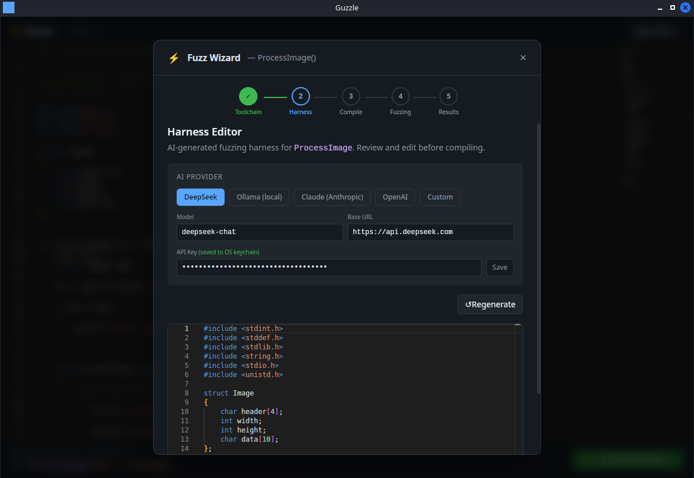

# ⚡ Guzzle

**libFuzzer made easy.** Open a C/C++ file, click a function, and fuzz it in minutes — no harness writing, no compiler flags to memorise.

Guzzle wraps [libFuzzer](https://llvm.org/docs/LibFuzzer.html) in a desktop GUI that handles harness generation (via AI), compilation, live fuzzing, crash triage, and exploit scaffolding. It works on source files or pre-built libraries.



---

## Features

- Click any function in a C/C++ file to fuzz it
- AI-generated harness (DeepSeek, Claude, OpenAI, Ollama, or any OpenAI-compatible API)
- Harness caching — re-open a function instantly without a new AI call
- Compile with ASan + UBSan in one click
- Live fuzzer output, coverage stats, and crash detection
- Crash hex dump + reproduce command
- **Gen PoC** — compiles a standalone reproducer, extracts ROP gadgets, and uses AI to generate a pwntools exploit scaffold
- Library mode — link against pre-built `.a`/`.so`/`.dylib` to fuzz third-party libraries

---

## Installation

<details>
<summary><strong>Kali Linux / Debian / Ubuntu</strong></summary>

### 1. Install system dependencies

Tauri uses WebKitGTK as its rendering engine on all Linux desktops — including KDE. The GTK libraries are required regardless of your DE and coexist fine alongside Qt.

```bash
sudo apt update
sudo apt install -y \
  build-essential \
  curl \
  wget \
  file \
  libssl-dev \
  libgtk-3-dev \
  libwebkit2gtk-4.1-dev \
  libayatana-appindicator3-dev \
  librsvg2-dev \
  libglib2.0-dev \
  libatk1.0-dev \
  libgdk-pixbuf-2.0-dev \
  libcairo2-dev \
  libpango1.0-dev \
  libasound2-dev
```

> On older Debian/Ubuntu, `libwebkit2gtk-4.1-dev` may be `libwebkit2gtk-4.0-dev`.

### 2. Install LLVM + Clang with libFuzzer

```bash
sudo apt install -y clang llvm lld
```

Verify libFuzzer is available:

```bash
echo '#include <stdint.h>
#include <stddef.h>
int LLVMFuzzerTestOneInput(const uint8_t *d, size_t s){return 0;}' \
  | clang++ -x c++ - -fsanitize=fuzzer -o /tmp/guzzle_test && echo "OK"
```

If that fails, the libFuzzer runtime may be in a separate package:

```bash
sudo apt install -y libclang-rt-dev
```

If `libclang-rt-dev` doesn't exist (older distros ship versioned packages), find and install the matching version:

```bash
apt-cache search libclang-rt | grep "^libclang-rt-[0-9]"
# e.g. for clang-16:
sudo apt install -y libclang-rt-16-dev
```

### 3. Install Rust

```bash
curl --proto '=https' --tlsv1.2 -sSf https://sh.rustup.rs | sh
source "$HOME/.cargo/env"
```

### 4. Install Node.js (v18+)

```bash
curl -fsSL https://deb.nodesource.com/setup_20.x | sudo -E bash -
sudo apt install -y nodejs
```

### 5. Build Guzzle

```bash
git clone https://github.com/jabberwock/guzzle
cd guzzle
npm install
npm run tauri build
```

The built app will be at `src-tauri/target/release/guzzle`.

To run in dev mode:

```bash
npm run tauri dev
```

</details>

---

<details>
<summary><strong>macOS</strong></summary>

### 1. Install LLVM via Homebrew

macOS ships with Apple Clang which does **not** include libFuzzer. You need LLVM from Homebrew:

```bash
brew install llvm
```

Guzzle automatically finds Homebrew LLVM — no PATH changes needed. To verify manually:

```bash
echo '#include <stdint.h>
int LLVMFuzzerTestOneInput(const uint8_t *d, size_t s){return 0;}' \
  | $(brew --prefix llvm)/bin/clang++ -x c++ - -fsanitize=fuzzer -o /tmp/guzzle_test && echo "OK"
```

### 2. Install Rust

```bash
curl --proto '=https' --tlsv1.2 -sSf https://sh.rustup.rs | sh
source "$HOME/.cargo/env"
```

### 3. Install Node.js (v18+)

```bash
brew install node
```

### 4. Install Xcode Command Line Tools (if not already)

```bash
xcode-select --install
```

### 5. Build Guzzle

```bash
git clone https://github.com/jabberwock/guzzle
cd guzzle
npm install
npm run tauri build
```

The built `.app` will be at `src-tauri/target/release/bundle/macos/Guzzle.app`.

To run in dev mode:

```bash
npm run tauri dev
```

</details>

---

<details>
<summary><strong>Windows (experimental)</strong></summary>

> **Note:** Windows support is experimental. libFuzzer requires LLVM Clang — MSVC does not include it.

### 1. Install LLVM

Download and install the latest LLVM release from [releases.llvm.org](https://releases.llvm.org/).

During installation, select **"Add LLVM to system PATH"**.

Verify:

```powershell
clang --version
```

To verify libFuzzer support, save this to `test.cpp` and compile it:

```cpp
#include <stdint.h>
#include <stddef.h>
int LLVMFuzzerTestOneInput(const uint8_t *d, size_t s) { return 0; }
```

```powershell
clang++ -fsanitize=fuzzer test.cpp -o test.exe
```

If that fails, libFuzzer runtime is not bundled in your LLVM build — check the LLVM release notes for Windows fuzzer support.

### 2. Install Rust

Download and run [rustup-init.exe](https://rustup.rs/).

### 3. Install Node.js

Download from [nodejs.org](https://nodejs.org/) (v18+).

### 4. Install WebView2

Required by Tauri — usually already present on Windows 10/11. If not: [download here](https://developer.microsoft.com/en-us/microsoft-edge/webview2/).

### 5. Build Guzzle

```powershell
git clone https://github.com/jabberwock/guzzle
cd guzzle
npm install
npm run tauri build
```

</details>

---

<details>
<summary><strong>Usage</strong></summary>

### Fuzzing a function in a source file

1. Click **Open C/C++ File** and select your `.c`, `.cpp`, or `.h` file
2. Click any line inside a function — a banner appears with the detected signature
3. Click **Fuzz this function →** to open the wizard
4. **Toolchain** — Guzzle checks your clang install automatically
5. **Harness** — AI generates a fuzzing harness; review and edit it if needed. Previously accepted harnesses load instantly from cache.
6. **Compile** — select sanitizers (ASan on by default) and compile
7. **Fuzzing** — watch live output; crashes appear as they're found
8. **Results** — view crash hex dumps, the reproduce command, and optionally generate a PoC script

### Fuzzing a library (e.g. OpenSSL, libpng)

1. Pre-compile the library with fuzzer instrumentation:
   ```bash
   CC=clang CFLAGS="-fsanitize=fuzzer-no-link,address" ./configure
   make
   ```
2. Open the library's **header file** (`.h`) in Guzzle and click a function
3. In the **Compile** step, click **+ Add library** and select your `.a`/`.dylib`/`.so`
4. Add the header directory to **Include Paths**
5. Compile and fuzz as normal

### Generating a PoC / exploit script

After a crash is found, select it in the Results panel and click **Gen PoC**. This:

1. Compiles a standalone reproducer binary (no libFuzzer, no sanitizers, `-no-pie -fno-stack-protector`)
2. Verifies the crash reproduces
3. Extracts ROP gadgets with `ROPgadget` or `ropper` (must be installed: `pip3 install ROPgadget`)
4. Calls AI to generate a pwntools Python3 exploit scaffold

**To run the generated script:**

```bash
pip3 install pwntools          # if needed
ulimit -c unlimited            # enable core dumps
echo 0 | sudo tee /proc/sys/kernel/randomize_va_space  # disable ASLR
python3 exploit.py
```

> **Exits with code 0?** The crash was caught by ASan but didn't produce a native SIGSEGV — common with small heap overflows. Confirm the bug is real with:
> ```bash
> clang++ -O0 -g -fsanitize=address harness.cpp target.c reproducer_main.c -o asan_repro
> ./asan_repro .guzzle/crashes/crash-<hash>
> ```
> The pwntools script is most useful for **stack-buffer-overflow** crashes. Heap/UAF/double-free won't yield a traditional ROP chain, and offsets/libc addresses usually need manual tuning.

</details>

---

<details>
<summary><strong>AI Providers</strong></summary>

Guzzle supports multiple AI backends for harness generation and PoC scripting:

| Provider | Notes |
|---|---|
| **DeepSeek** (default) | Cheap, fast, good at C/C++ |
| **Ollama** | Fully local, no API key needed |
| **Claude** | Anthropic API — strong at understanding complex codebases |
| **OpenAI** | GPT-4o and friends |
| **Custom** | Any OpenAI-compatible endpoint |

API keys are stored in your OS keychain (Keychain on macOS, Secret Service on Linux, Credential Manager on Windows).

</details>

---

<details>
<summary><strong>How it works</strong></summary>

1. **Parsing** — [tree-sitter](https://tree-sitter.github.io/) extracts the function signature at your cursor
2. **Harness generation** — the AI receives the signature + surrounding code context and writes a `LLVMFuzzerTestOneInput` harness; accepted harnesses are cached in `.guzzle/harness_cache.json` keyed by file hash + function name
3. **Compilation** — Guzzle injects a preamble (`exit()` intercept) and postamble, then compiles harness + target with `clang++ -fsanitize=fuzzer,address`
4. **Fuzzing** — the compiled binary is run as a libFuzzer target; output is streamed live
5. **Crash detection** — crash files are watched in `.guzzle/crashes/` and shown in the Results panel
6. **PoC generation** — a sanitizer-free reproducer is compiled, ROP gadgets extracted, and AI generates a pwntools exploit scaffold

Corpus and crashes are saved in `.guzzle/` next to your source file:

```
.guzzle/
  fuzzer             # compiled fuzzer binary
  reproducer         # standalone crash reproducer (no ASan)
  corpus/            # fuzzer-generated test cases
  crashes/           # crash inputs
  harness.cpp        # the harness as compiled
  harness_cache.json # cached AI-generated harnesses
```

</details>

---

<details>
<summary><strong>Contributing</strong></summary>

PRs and issues welcome. A few ground rules:

**Before opening a PR**
- Open an issue first for anything non-trivial so we can agree on direction
- Keep PRs focused — one thing per PR
- Test on at least one real C/C++ file end-to-end before submitting

**Stack**
- Frontend: Tauri 2 + React 18 + TypeScript + Tailwind CSS v4
- Backend: Rust (Tauri commands in `src-tauri/src/commands/`)
- Dev mode: `npm run tauri dev` from the project root

**What's welcome**
- Bug fixes (always welcome — please include steps to reproduce in the issue)
- New AI provider presets
- Better tree-sitter parsing for edge-case C/C++ signatures
- Distro-specific install fixes / docs
- Windows testing and fixes (experimental platform, needs love)

**What to avoid**
- Large refactors without prior discussion
- Adding dependencies without a clear reason
- UI changes that break the existing wizard flow

**libFuzzer note**
When writing tests or verify commands, always use `LLVMFuzzerTestOneInput` as the entry point — never `int main()`. libFuzzer provides its own `main()` and the linker will reject a file that defines both.

</details>

---

## Special Thanks to:

- ryan_ (for the AGENT idea, making this a GUI or all-in-one CLI experience)
